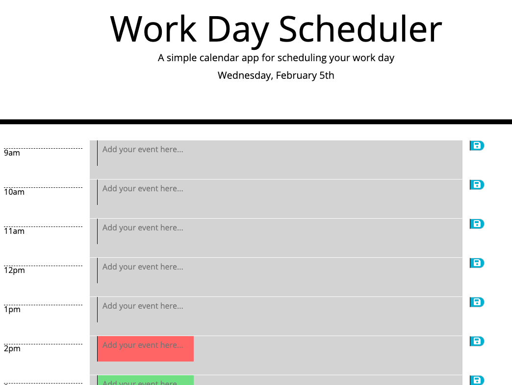

# workdayschedule

# Description

As part of the UCF coding bootcamp homework for week 5, the workday scheduler is a simple calendar application that allows the user to save events for each hour of the day. The user will be able to see color coded lists by the hour representing past, present and future todos. User can also save items to local storage so they do no disappear when the page is reloaded.

# User Story

AS AN employee with a busy schedule
I WANT to add important events to a daily planner
SO THAT I can manage my time effectively

# Acceptance Criteria

GIVEN I am using a daily planner to create a schedule
WHEN I open the planner
THEN the current day is displayed at the top of the calendar
WHEN I scroll down
THEN I am presented with timeblocks for standard business hours
WHEN I view the timeblocks for that day
THEN each timeblock is color coded to indicate whether it is in the past, present, or future
WHEN I click into a timeblock
THEN I can enter an event
WHEN I click the save button for that timeblock
THEN the text for that event is saved in local storage
WHEN I refresh the page
THEN the saved events persist

# Technologies

This app will run in the browser and feature dynamically updated HTML and CSS powered by jQuery.

# Challenges

Believe you me, one of the hardest parts of this project was trying to get everything lined up on the webpage, especially the alignment of the card. I tried bootstraps very own jumbotron. I tired cards, good ol containers and even tried to implement a progress bar at some point instead of the seconds counting down. A friend of mine was successfull in that remark but I decided it wasnt worth the hassle.

# Demo

[Try the app here] ( https://siryaw.github.io/workdayschedule/.) 

# License

MIT

Use this code as you wish, my dear :)
